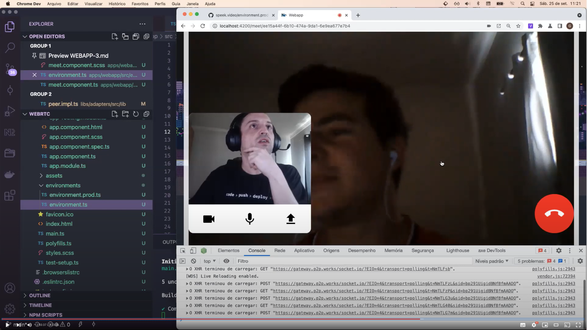

# WebRTC


## Package

- Ports [ [source](libs/ports/src/lib) -  [npm](https://www.npmjs.com/package/@webp2p/ports) ]
- Adapters [ [source](libs/adapters/src/lib) - [npm](https://www.npmjs.com/package/@webp2p/adapters) ]

## Install

```sh
npm i @webp2p/ports
```

```sh
npm i @webp2p/adapters
```

---

## Workshop
[Streaming P2P de áudio, vídeo e dados na Web com TypeScript](https://www.codecon.dev/workshops/webtrc) por [Guilherme Visi Siquinelli](https://guiseek.dev)


[Signaling and WebApp - Step by step](docs/PORTS.md)

---

[
  
](https://youtu.be/DHyFewCiOLs)

## Example

```ts
import { ActivatedRoute, Router } from '@angular/router';
import { Component, OnInit } from '@angular/core';
import { BehaviorSubject } from 'rxjs';
import { Peer } from '@webp2p/ports';

@Component({
  selector: 'webrtc-meet',
  templateUrl: './meet.component.html',
  styleUrls: ['./meet.component.scss'],
})
export class MeetComponent implements OnInit {
  meet: string;

  private _progress = new BehaviorSubject<number>(0);
  public progress$ = this._progress.asObservable();

  constructor(
    readonly route: ActivatedRoute,
    private _router: Router,
    readonly peer: Peer
  ) {
    const { meet } = this.route.snapshot.params;
    if (meet) this.meet = meet;
    else this.meet = '';
  }

  ngOnInit(): void {
    this.peer.connect(this.meet);
    this.peer.event.on('progress', ({ percent }) => {
      this._progress.next(percent);
    });

    this.peer.event.on('dataChannel', (channel) => {
      console.log('RTC Data Channel: ', channel);
      setTimeout(() => this.peer.send('obaaaa'), 10000);
    })

    this.peer.event.on('message', (message) => {
      console.log('message: ', message);
    })
  }

  end() {
    this.peer.close();
    this._router.navigate(['/']);
  }
}
```